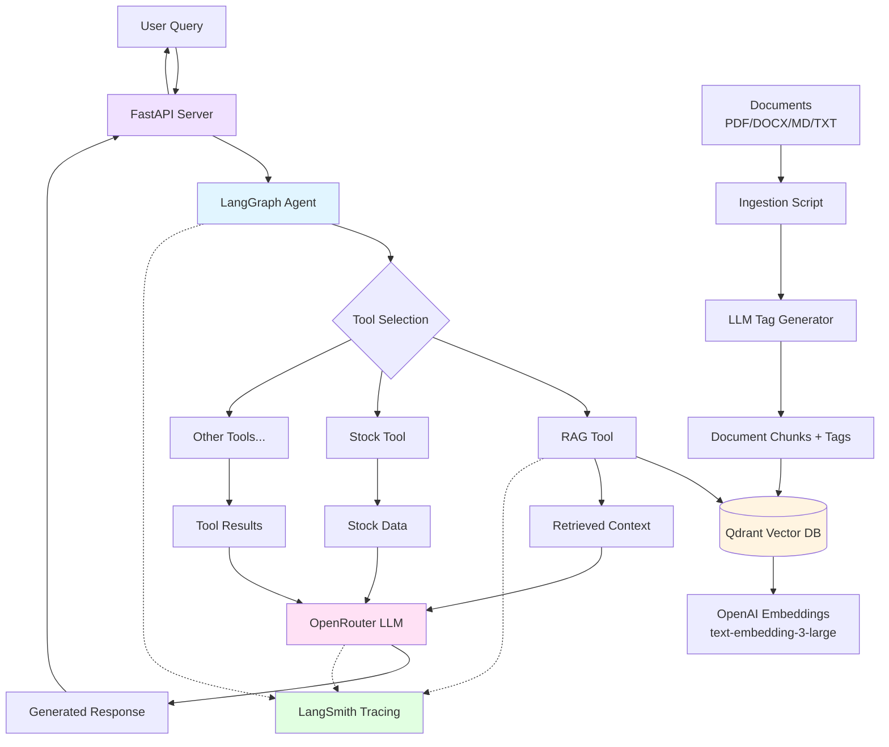

# RAG Application with LangGraph and Qdrant

A Retrieval-Augmented Generation (RAG) application built with LangGraph, Qdrant vector database, and OpenRouter API. Includes full LangSmith observability for tracing, monitoring, and feedback collection.

## Features

- **RAG Pipeline**: Retrieval-Augmented Generation with LangGraph
- **Vector Search**: Qdrant for efficient similarity search
- **LangSmith Observability**: Full tracing, monitoring, and feedback collection
- **Multi-format Support**: PDF, DOCX, MD, TXT document ingestion
- **FastAPI Server**: RESTful API with automatic documentation

## Architecture

This application uses an **agent-based architecture** with LangGraph:
- **Agent with Tools**: LLM agent that can use multiple tools to answer queries
- **RAG Tool**: Searches knowledge base and retrieves relevant documents
- **Extensible Tool System**: Easy to add new tools (calculator, web search, etc.)
- **Vector Store**: Qdrant for efficient similarity search with custom schema
- **LLM-Generated Tags**: Automatic tagging of document chunks for better organization
- **Observability**: LangSmith tracing on all operations



## Setup

1. Install dependencies:
```bash
pip install -r requirements.txt
```

2. Configure environment variables:
```bash
cp .env.example .env
# Edit .env with your API keys
```

3. Start Qdrant (using Docker):
```bash
docker run -p 6333:6333 qdrant/qdrant
```

4. Ingest documents (supports PDF, DOCX, MD, TXT):
```bash
python scripts/ingest_documents.py --dir data
```

5. Run the FastAPI server:
```bash
python main.py
```

The API will be available at `http://localhost:8000`

6. Run the frontend (optional):
```bash
cd fe
npm install
npm run dev
```

The UI will be available at `http://localhost:3000`

## Project Structure

```
.
├── langgraph.json          # LangGraph configuration
├── requirements.txt        # Python dependencies
├── .env                    # Environment variables
├── main.py                 # FastAPI server
├── data/                   # Documents to ingest
│   └── sample.txt
├── scripts/
│   └── ingest_documents.py # Document ingestion script
├── src/
│   ├── __init__.py
│   ├── agent_graph.py      # Agent graph with tool calling
│   ├── agent_state.py      # Agent state schema
│   ├── vectorstore.py      # Qdrant setup
│   ├── tag_generator.py    # LLM tag generation
│   └── tools/              # Agent tools
│       ├── __init__.py
│       ├── rag_tool.py     # RAG knowledge base tool
│       └── example_tool.py # Template for new tools
└── fe/                     # Frontend (Next.js)
    ├── app/                # Next.js app directory
    ├── components/         # React components
    └── lib/                # API utilities
```

## Usage

### API Endpoints

**Health Check**
```bash
curl http://localhost:8000/
```

**Chat Endpoint**
```bash
curl -X POST http://localhost:8000/chat \
  -H "Content-Type: application/json" \
  -d '{"query": "What is LangGraph?"}'
```

**Response Format**
```json
{
  "query": "What is LangGraph?",
  "answer": "LangGraph is a library for building...",
  "sources_count": 3,
  "run_id": "abc123..."
}
```

**Submit Feedback**
```bash
curl -X POST http://localhost:8000/feedback \
  -H "Content-Type: application/json" \
  -d '{
    "run_id": "abc123...",
    "score": 1.0,
    "comment": "Great answer!"
  }'
```

### Add Your Own Documents

Place PDF, DOCX, MD, or TXT files in the `data/` directory and run:
```bash
python scripts/ingest_documents.py --dir data
```

### Interactive API Documentation

Visit `http://localhost:8000/docs` for Swagger UI documentation

## Configuration

Edit `.env` to customize:
- `OPENAI_API_KEY`: Your OpenAI API key (for text-embedding-3-large embeddings)
- `OPENROUTER_API_KEY`: Your OpenRouter API key (for LLM)
- `MODEL_NAME`: LLM model to use
- `QDRANT_URL`: Qdrant instance URL
- `QDRANT_COLLECTION_NAME`: Collection name for documents
- `LANGSMITH_API_KEY`: Your LangSmith API key
- `LANGSMITH_PROJECT`: Project name in LangSmith
- `LANGSMITH_TRACING`: Enable/disable tracing (true/false)

**Note**: This app uses OpenAI's `text-embedding-3-large` (3072 dimensions) for vector embeddings and OpenRouter for LLM inference.

## LangSmith Observability

This project includes comprehensive LangSmith integration for observability:

- **Automatic Tracing**: All RAG operations are traced
- **Metadata Tracking**: Model, endpoint, and custom metadata
- **Feedback Collection**: Thumbs up/down with comments
- **Monitoring**: View aggregate metrics and performance
- **A/B Testing**: Compare different models or configurations

See [LANGSMITH_GUIDE.md](LANGSMITH_GUIDE.md) for detailed documentation.

**Quick Test:**
```bash
python test_langsmith.py
```

**View Traces:**
Visit https://smith.langchain.com and select your project.
